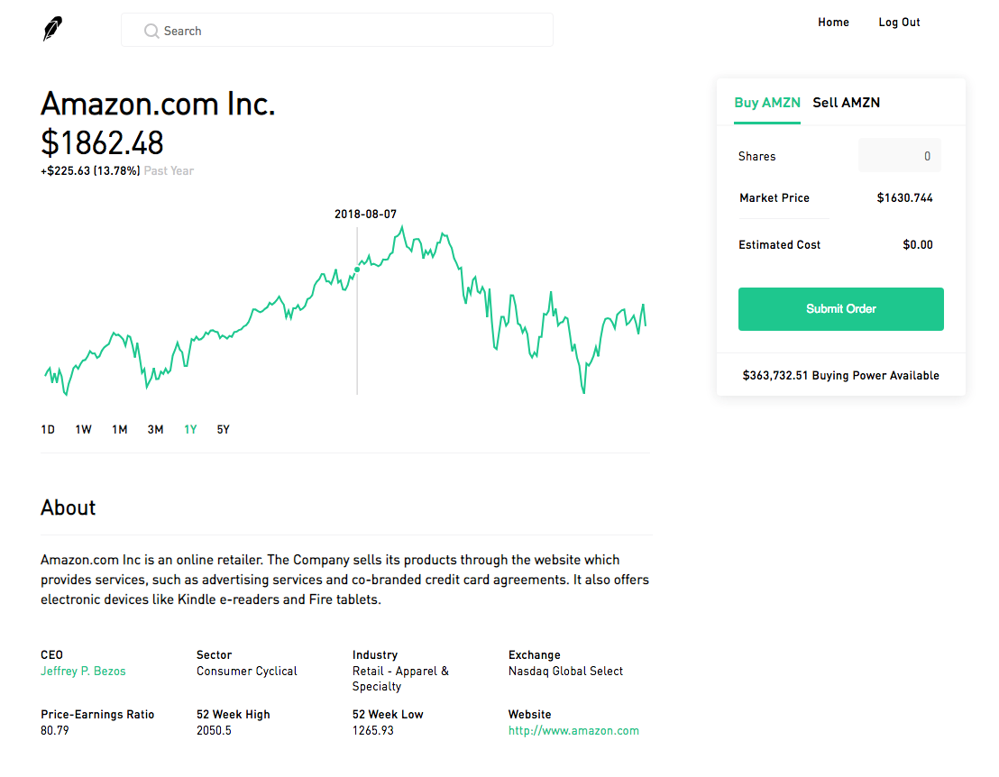

# Everdeen
[Everdeen](https://everdeen-app.herokuapp.com/#/) is a faithful clone of Robinhood, a stock investing web application. However, Everdeen allows you to invest for free, so that users may learn how to invest and follow stocks without the pressure of losing real money. This project was conceptualized and built within 10 days. Noteworthy technologies used: Ruby on Rails and React/Redux. Read on more to find out about the APIs I used and approaches I took to solving the problems I faced.

## Technologies
* Backend: PostgreSQL, Ruby on Rails
* Frontend: React/Redux
* [IEX API](https://iextrading.com) (used to fetch intraday, weekly, monthly, and yearly stock price data)
* [News API](https://newsapi.org/) (used to fetch current news about stocks)
* [Recharts](http://recharts.org/en-US/) (used to help draw candlestick charts)

## Features
* Secure frontend/backend user authentication using BCrypt
* Portfolio chart showing the user's overall portfolio value based on stocks they own
* Sidebar showing the user's number of shares owned alongside their respective name, price, and intraday chart
* Real-time and historical price data for most stocks exchanged on the NYSE and Nasdaq exchanges
* Ability to buy and sell shares at the latest price
* Searchable stocks (either by company name or stock symbol)
* Real-time newsfeed showing general and stock-specific business news articles

### Dashboard/Portfolio Page
After logging in successfully, the user is redirected to their dashboard, which shows a portfolio value chart.<br/>
The challenging part about making a portfolio chart is fetching all the required data. Users can view their portfolio value changes on the same day, over a week, or even a few years. Intraday changes are fairly easy. The portfolio chart shows the portfolio value at intervals of 5 minutes between 9:30 AM ET and 4:00 PM ET, which is when the stock market opens and closes. A portfolio's value is calculated by: user_balance (money the user may have deposited) + total_value_of_owned_stocks (the sum total worth of the user's owned stocks based on the current time or date). When the user requests data from one week ago or later, a request to the backend is made to fetch the user's balance, owned stocks, and the prices of those stocks from that time period. The change in price (increase or decrease and percentage) is dynamically calculated as the user hovers over different time points on the chart.

```ruby
def intraday_data
    open_balance = opening_balance(Time.now)
    stocks = shares_owned

    url = 'https://api.iextrading.com/1.0/stock/market/batch?types=chart&chartInterval=5&range=1d&symbols='
    stocks.each do |ticker, _|
      url += "#{ticker},"
    end
    uri = Net::HTTP.get(URI(url))
    response = JSON.parse(uri)

    balance_at_times = Hash.new(open_balance)
    stocks.each do |ticker, num_shares|
      charts = response[ticker]['chart']
      charts.each do |chart|
        if chart['marketOpen'] && chart['label'] != '09:30 AM'
          balance_at_times[chart['label'] + ' ET'] += chart['marketOpen'] * num_shares
        end
      end
    end

    balance_at_times
  end
```


### Stock Show Page


### Search

